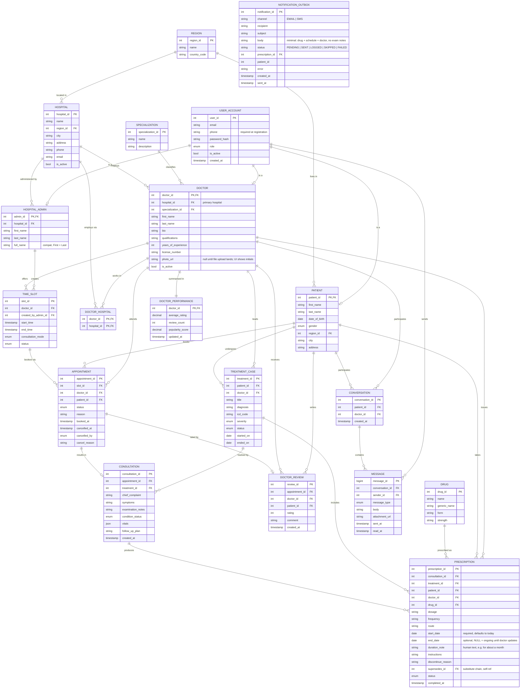

# ER Model — Hospital Appointment & Treatment Tracking App

## 1. Actors and scope

Three roles share one login table (`USER_ACCOUNT`) and are specialised into `PATIENT`, `DOCTOR` and `HOSPITAL_ADMIN`.

- **Patient** — browses doctors of any hospital, books/cancels appointments, sees current prescriptions, chats with doctors.
- **Doctor** — sees a timetable, records consultations, tracks treatment and condition, prescribes drugs, chats.
- **Hospital admin** — creates and manages doctors' time slots, sees private doctor feedback/rating/popularity.

## 2. ER diagram (Mermaid)

## 3. Key design decisions

1. **Supertype/subtype for users.** One `USER_ACCOUNT` (login, role) with 1:0..1 subtype tables. Chat messages can then reference a single sender key regardless of role.
2. **Region is independent of booking.** A patient's `region_id` is only profile data; slots belong to doctors, so a patient from a remote region books any hospital's slot with no phone numbers involved. `consultation_mode` (`IN_PERSON` / `ONLINE`) lets remote patients take online visits.
3. **Slots are managed by admins only.** `TIME_SLOT.created_by_admin_id` records who made it. A doctor's slots may not overlap (exclusion constraint in the SQL).
4. **Cancellation keeps history.** A cancelled appointment stays as a row with `status = CANCELLED`, and its slot returns to `AVAILABLE`. A partial unique index guarantees a slot has at most one non-cancelled appointment, which prevents double booking.
5. **Appointment status lifecycle:** `SCHEDULED → COMPLETED | CANCELLED | NO_SHOW`.
6. **Treatment tracking.** `TREATMENT_CASE` is the long-running condition being treated (diagnosis, severity, status). Each `CONSULTATION` (1:0..1 with an appointment) belongs to a case and records symptoms, notes, vitals and `condition_status` (`IMPROVING / STABLE / WORSENING / RESOLVED`). Reading the consultations of a case in time order gives the full progression of the patient's condition.
7. **Prescriptions.** One row per prescribed drug, linked to the consultation, the case, the drug catalogue entry, patient and doctor. Status is `ACTIVE → COMPLETED | DISCONTINUED`. Marking a drug done never deletes it: the patient view filters `status = 'ACTIVE'`, the doctor view shows everything.
8. **Private doctor metrics are separate entities.** `DOCTOR_REVIEW` and `DOCTOR_PERFORMANCE` (rating, popularity) are split from `DOCTOR` so that the public profile (specialization, bio, qualifications, experience) can be exposed to patients without any risk of leaking rating data. Only hospital admins may read them; patients may only insert a review for their own completed appointment (one per appointment).
9. **Chat.** One `CONVERSATION` per patient–doctor pair, many `MESSAGE`s. `message_type` (`TEXT / IMAGE / VOICE / FILE`) with `attachment_url` covers "speaking" via voice notes. Real-time calls would be handled by a separate service.

## 4. Business rules not expressible as plain keys (enforce in service layer or triggers)

- `appointment.patient_id` must equal `treatment_case.patient_id` of its consultation.
- A doctor only creates treatment cases, consultations and prescriptions for patients who have an appointment with them.
- A review requires `appointment.status = COMPLETED`.
- Conversation creation requires at least one non-cancelled appointment between the pair.
- A patient may cancel only while `status = SCHEDULED` and before a cutoff time (policy parameter).
- Booking = one transaction: lock the slot row, check `AVAILABLE`, insert appointment, set slot `BOOKED`. Cancellation reverses it.
- Prescription becomes `COMPLETED` when the doctor marks it, or automatically by a job once `end_date` has passed.

## 5. Access matrix

| Data | Patient | Doctor | Hospital admin |
|---|---|---|---|
| Doctor public profile (specialization, bio, qualifications, experience) | read | read/edit own | read/edit |
| Doctor rating, reviews, popularity | no | no | read |
| Time slots | read available | read own (timetable) | create/update/delete |
| Appointments | own: create, cancel, read | own: read, update status | read for hospital |
| Treatment cases, consultations | no | read/write own patients | no |
| Prescriptions | own, `ACTIVE` only | all, read/write | no |
| Chat | own conversations | own conversations | no |

Implement the "no" cells with database views plus role-based checks in the API (and optionally Row-Level Security); the SQL file provides the views `v_doctor_public_profile` and `v_patient_active_prescription`.
